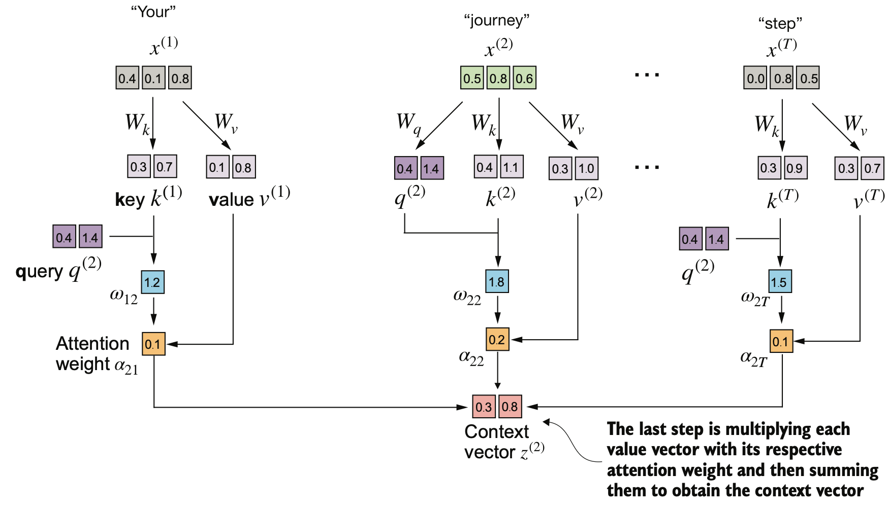

# CTX-Translator
CTX-Translator is a context-aware English-to-Chinese translation model that understands and adapts word meanings based on their surrounding text. Unlike traditional dictionary-style translators, it provides accurate and dynamic translations that reflect the true sense of each English word in its specific context.

## Introduction

The motivation for this work comes from a problem I encountered while learning English — many words have multiple meanings, but traditional word translation tools mechanically display all possible meanings of a word. Moreover, some words actually form fixed phrases or idioms with surrounding words, which traditional translation software cannot recognize. Therefore, I started wondering: what if I could input not only the target word but also all its surrounding sentences (context)? In that case, the translation system could tell me what **the word means in this specific sentence** and whether it forms a **fixed phrase** with nearby words.

I believe large language models (LLMs) are well-suited for this task. At least from my experience using ChatGPT, I have seen how powerful its language understanding is. So I thought — could I fine-tune a smaller model locally, allowing a frontend to call it as an API that performs context-aware single-word translation? In this work, I chose the popular LoRA fine-tuning method. In fact, LoRA itself has several variants.

## Choice of Base Model

There are several questions to consider here:

1. What type of model should I choose? For example, a **general model**, a **math model**, or a **programming model**.
2. Should I use a **base model** or a **chat model**? A base model is one that has only been pre-trained and cannot converse with users. In contrast, a chat model has undergone post-training (such as RLHF) and is capable of dialogue.

**Answers:**
1. In this case, I will choose a **translation model** (English → Chinese), since it naturally contains the most multilingual mapping data.
2. My final goal is to build an API where the input is a word, a sentence, and the word’s position within that sentence, and the output is its meaning and whether it forms a fixed phrase. Because this input-output format is relatively fixed and doesn’t require conversational ability, I chose a **base model**.

Ultimately, I selected [ModelSpace/GemmaX2-28-2B-v0.1](https://huggingface.co/ModelSpace/GemmaX2-28-2B-v0.1).  
After some testing, I found that [ModelSpace/GemmaX2-28-9B-v0.1](https://huggingface.co/ModelSpace/GemmaX2-28-9B-v0.1) performs better, but my Mac only has 64 GB of RAM, which isn’t enough to run the 9B version, so I settled on the 2B model.

The GemmaX2-28-2B-v0.1 model was trained and then fine-tuned from GemmaX2-28-2B-Pretrain, so the entire model chain has not undergone RLHF training for chat.

Therefore, the prompt format for GemmaX2-28-2B is also fixed:

``` python
"Translate this from English to Chinese:\nEnglish: I love translation\nChinese:"

```

When fine-tuning a model, we should always choose the approach that matches our specific task and usage scenario.

The main reason I chose a translation model is that it already **contains rich multilingual mapping knowledge**. Since the final model I aim to obtain is also a translation model, this provides a strong starting point.

## Why Choose LoRA

Based on the principles of LoRA, the training speed can be significantly faster, so I chose this method.

Essentially, LoRA adds another matrix on top of a parameter matrix to influence its values. It then factorizes this large matrix into two low-rank matrices, greatly reducing the amount of training required.

Why is this decomposition possible? Because of the matrix multiplication rule:

If A ∈ ℝ^(m×n) and B ∈ ℝ^(n×p), then C = AB ∈ ℝ^(m×p)

To obtain a matrix C of size m×p from A and B, we only need:
1. A to have m rows and B to have p columns
2. The number of columns in A and the number of rows in B to match (n). This value can be chosen arbitrarily and serves as a hyperparameter. By adjusting it, we change the size of A and B, which affects the training complexity and model performance (generally, more trainable parameters lead to better performance but slower training).

## Dataset

This step is very important — I need to prepare two types of data:
1. English sentences  
2. A large model (API-based or local) that can provide correct translations — this serves as the **teacher model** to be distilled.  
   The English sentences and selected words are fed into this model to generate the target outputs that my base model will learn from.

### English Sentences

I found a Chinese Mandarin → English dataset from [https://www.manythings.org/anki/](https://www.manythings.org/anki/).  
It contains 29,909 English sentences along with their translations.  
For my purpose, I only extracted the English sentences.

See `data/cmn.txt`.

### Teacher Model (for Distillation)

For this experimental project, I used a distillation setup.  
The teacher model I chose is **mlx-community/gemma-3-27b-it-qat-8bit**.

Why this model?  
Because after testing several smaller models, I found that this one has the best instruction-following ability and also provides strong translation quality.

### Distillation Data

The distillation process is straightforward —  
I extract each word from every English sentence (excluding stop words)  
and then combine them into a fixed-format prompt:


``` json
{"context": "It's time to hit the sack.", "target": "hit", "idx": 1}
```
Then I send this prompt to **gemma-3-27b-it-qat-8bit** (the built-in MLX server was not very convenient — it had issues with queue control, so I wrote my own), and then obtain its output:

``` json
{"class": "verb", "zh": "打", "phrase": "hit the sack|上床睡觉"}
```

The format above is already quite clear, so I won’t explain it further.  
Each line in the dataset consists of one **prompt** and its corresponding **response**.  
Please refer to `data/final_data_4000_v1.json`.

``` json
...
{"prompt": "{\"context\": \"My passport's been stolen.\", \"target\": \"stolen\", \"idx\": 1}", "response": "{\"class\": \"verb\", \"zh\": \"被偷\", \"phrase\": \"been stolen|被偷\"}"}
{"prompt": "{\"context\": \"My passport's been stolen.\", \"target\": \"stolen\", \"idx\": 1}", "response": "{\"class\": \"verb\", \"zh\": \"被偷\", \"phrase\": \"been stolen|被偷\"}"}
{"prompt": "{\"context\": \"My passport's been stolen.\", \"target\": \"stolen\", \"idx\": 1}", "response": "{\"class\": \"verb\", \"zh\": \"被偷\", \"phrase\": \"been stolen|被偷\"}"}
{"prompt": "{\"context\": \"My phone was out of order.\", \"target\": \"out\", \"idx\": 1}", "response": "{\"class\": \"adverb\", \"zh\": \"不在服务\", \"phrase\": \"out of order|失修\"}"}
{"prompt": "{\"context\": \"My phone was out of order.\", \"target\": \"order\", \"idx\": 1}", "response": "{\"class\": \"noun\", \"zh\": \"顺序;秩序\", \"phrase\": \"out of order|失灵\"}"}
{"prompt": "{\"context\": \"One of your tires is flat.\", \"target\": \"flat\", \"idx\": 1}", "response": "{\"class\": \"adjective\", \"zh\": \"平的\", \"phrase\": \"is flat|是平的\"}"}
{"prompt": "{\"context\": \"Out of sight, out of mind.\", \"target\": \"out\", \"idx\": 1}", "response": "{\"class\": \"preposition\", \"zh\": \"在...之外\", \"phrase\": \"out of sight|视线之外\"}"}
...
```

## Start Training with LoRA

I referred to the LoRA fine-tuning code from [https://github.com/rasbt/LLMs-from-scratch](https://github.com/rasbt/LLMs-from-scratch).  
The author’s book is also excellent — it explains concepts clearly and deeply.

### Which Parameter Matrices Are Modified by LoRA?

According to the official LoRA paper, the additional low-rank matrices are recommended to be applied to the **Q** and **V** parameter matrices.  
In this project, I tested several configurations: QV, QKV, LoRA applied only to the linear layers inside the FFN, and full-parameter training.

The key idea is simply to identify which parameters are trainable and experiment continuously — just like tuning hyperparameters.  
Therefore, it’s essential to be familiar with the structure of a Transformer block. Let’s briefly review it.

#### Transformer Block Overview

Simply put, a Transformer block mainly consists of:
- one **attention block**,  
- one **feed-forward network (FFN)**,  
- plus two dropout layers and two layer normalization layers  
  (not batch normalization — BatchNorm heavily depends on batch size and is expensive to compute in distributed training).  

See the figure below:


[transformer block overview]

The most critical attention module is conceptually simple:  
it’s a **weighted sum** mechanism that measures the similarity between **Q** and each **K**.  
After scaling down the dot products, we apply softmax and then compute a weighted sum with **V**.  
Dividing by the dimensional scale helps prevent large similarity values in QK that could cause softmax to produce near one-hot distributions — which harms gradient learning (a common interview question!).

%20%3D%20%5Ctext%7Bsoftmax%7D%5Cleft(%20%5Cfrac%7BQK%5ET%7D%7B%5Csqrt%7Bd_k%7D%7D%20%5Cright)%20V)
[attention formula]


[transformer attention]

Finally, the most important point:  
in a Transformer, the trainable parameters include **W_Q**, **W_K**, and **W_V**, and in the case of multi-head attention, also **W_O**.  
The FFN contains two additional linear layers with trainable weights.  
I also experimented with modifying those layers, but the performance wasn’t good, so they were not included in the final code.

### Training Code

Please refer to `train_lora.py`.  
It combines code from *LLMs-from-scratch* with AI-generated snippets.  
I haven’t had time to clean up the code yet, so please excuse the rough version.

Here, I’ll highlight three key points:
1. The implementation of LoRA  
2. How to inject LoRA  
3. How to handle prompt masking

#### LoRA Implementation

In addition to multiplying matrices A and B, LoRA introduces a **scaling factor**.

> The scaling factor in LoRA controls how much the low-rank update affects the original weights.  
> It keeps the updates small and stable, preventing gradients from becoming too large or too weak.  
> In short, it helps balance learning speed and training stability.

In real-world engineering, certain practical deviations from theory may appear,  
and parameters like **scaling** make the method more robust and applicable in production environments.


``` python
# Core LoRA class: uses two low-rank matrices A and B to approximate updates to large weight matrices, enabling parameter-efficient fine-tuning
class LoRALinear(nn.Module):
    def __init__(self, base_layer: nn.Linear, rank: int = 8, alpha: float = 16):
        super().__init__()
        self.base = base_layer
        self.r = rank
        self.alpha = alpha
        self.scaling = alpha / rank

        in_features = base_layer.in_features
        out_features = base_layer.out_features

        device = base_layer.weight.device

        # LoRA matrix A: projects input into a low-rank subspace
        # A is the transform that maps the input into a smaller (rank-r) dimension
        self.lora_A = nn.Parameter(torch.zeros((rank, in_features), device=device))
        # LoRA matrix B: maps low-rank representation back to output space
        # Together with A, forms a low-rank approximation to a full-rank update to the original weight matrix
        self.lora_B = nn.Parameter(torch.zeros((out_features, rank), device=device))

        nn.init.kaiming_uniform_(self.lora_A, a=math.sqrt(5))
        nn.init.zeros_(self.lora_B)

        for param in self.base.parameters():
            param.requires_grad = False

    def forward(self, x):
        # LoRA forward logic: preserve original inference path and add a trainable low-rank update
        return self.base(x) + (x @ self.lora_A.T @ self.lora_B.T) * self.scaling

    @property
    def weight(self):
        return self.base.weight
```

#### inject lora

This part is not complicated either — it’s mainly about selecting which parameter matrices should remain trainable and freezing all others.  

If we think about it more broadly, **transfer learning**, **online learning**, and **fine-tuning** all share the same core principle:  
> keep some parameters fixed (to preserve core features) while allowing the remaining parameters to be trained.

For example, in computer vision (CV), many modern models only train the **feature extraction head**.  
We can take a pre-trained backbone model, attach a small **MLP (Multi-Layer Perceptron)** on top,  
freeze the main backbone, and make only the MLP trainable.  
With this setup, the model can be adapted for various tasks such as **classification**, **recognition**, or **instance segmentation** —  
all while retaining the powerful representations learned from large-scale pretraining.


``` python
def inject_lora(model, r=16, alpha=32, only_qkv=IS_ONLY_QKV, only_qv=IS_ONLY_QV):
    if only_qv:
        target_modules = ["q_proj", "v_proj"]
    else:
        target_modules = ["q_proj", "k_proj", "v_proj"]
    count = 0
    for name, module in model.named_modules():
        indent = "\t" * name.count(".")
        is_replace = isinstance(module, torch.nn.Linear)
        color = ""
        if isinstance(module, torch.nn.Linear):
            if any(n in name for n in target_modules):
                color = colorama.Fore.RED
            else:
                color = colorama.Fore.YELLOW
        # print(f"Lora:{indent}{color}{name},{type(module)}{colorama.Style.RESET_ALL}")

        if only_qkv:
            condition = any(n in name for n in target_modules) and isinstance(module, nn.Linear)
        else:
            condition = isinstance(module, nn.Linear)

        if condition:
            parent = model
            *path, attr = name.split(".")
            for p in path:
                parent = getattr(parent, p)
            setattr(parent, attr, LoRALinear(module, rank=r, alpha=alpha))
            count += 1
    print(f"Injected LoRA into {count} layers.")
```


#### Masking the Prompt

Masking the prompt during LoRA training is important because the model should not be optimized on the input instructions themselves.
By masking the prompt tokens, the loss is computed only on the response part,
which helps the model learn to generate correct answers rather than just repeat or memorize the prompt.

``` python
    input_ids = tokenized["input_ids"].squeeze(0)
    attention_mask = tokenized["attention_mask"].squeeze(0)
    labels = input_ids.clone()

    # find the start position of response
    prefix_text = build_gemma_prompt(prompt, response="", eos_token=eos, bos_token=bos, add_bos=False, add_eos=False)
    prefix_ids = tokenizer(prefix_text, add_special_tokens=False)["input_ids"]
    prefix_len = len(prefix_ids)

    # mask prompt
    labels[:prefix_len] = -100
    labels[attention_mask == 0] = -100
```

### Training result

``` logs
Average loss on 500 samples LoRA_QV: 0.2092
Average loss on 500 samples LoRA_QKV: 0.4135
Average loss on 500 samples LoRA_Linear: 1.4550
Average loss on 500 samples Full: 1.6094
```

Overall, QV works best, QKV is second, and adjusting only the two linear layers in the FFN or doing full-parameter training both lead to collapse.  
Full-parameter fine-tuning can easily destroy the model’s original knowledge.  
Of course, it might also be due to my limited fine-tuning data and insufficient training time.  
I’ve seen others report that full-parameter fine-tuning works best on large LLM datasets — likely because their datasets are large enough.


## In the future

I don’t really like the built-in loss computation used by large language models, because it simply measures token-level cross-entropy over raw text outputs, without understanding the structured meaning of the data. Since my model’s outputs are always in a fixed JSON format, I’m considering a new loss design with two components:
1. first, a structural loss that checks whether the output is a valid JSON object with correct keys and field structure;
2. and second, a content loss that computes the traditional language-model loss (e.g., cross-entropy) on the values within each field. This way, the model learns both to follow the required schema and to generate accurate field values.

Of course, the more important factor is the **dataset**.  
Currently, when using small models for distillation, the data quality is generally limited.  
Using large company APIs for this purpose is typically **not permitted** either.  
It may be necessary to construct large-scale datasets manually or semi-manually.  

Finally, in the era of large language models, the **quality and scale of datasets** have become critically important —  
they often determine the upper limit of a model’s capability.


## 📘 License Notice

This repository contains a model derived from Google's **Gemma 2** model,
originally released under the [Gemma License](https://ai.google.dev/gemma/terms).

The specific base model used is
[ModelSpace/GemmaX2-28-2B-v0.1](https://huggingface.co/ModelSpace/GemmaX2-28-2B-v0.1),
which itself is a fine-tuned derivative of **Gemma 2 (google/gemma-2-2b)**.

Use of this derivative model must comply with the
[Gemma License](https://ai.google.dev/gemma/terms) and the
[Gemma Prohibited Use Policy](https://ai.google.dev/gemma/prohibited_use_policy).

A copy of the Gemma License is included in this repository as `GEMMA_LICENSE.txt`.

### ⚠️ Important Notes
- Any redistribution or modification of this model must retain the Gemma License text.
- You must not use this model or its derivatives to train or facilitate other large language models that compete with Gemma or similar Google models.
- All downstream users must also comply with the Gemma License and usage restrictions.

---

## 🧩 Attribution
- Base model: [google/gemma-2-2b](https://huggingface.co/google/gemma-2-2b)
- Intermediate model: [ModelSpace/GemmaX2-28-2B-v0.1](https://huggingface.co/ModelSpace/GemmaX2-28-2B-v0.1)
- Derivative work: Bryce
